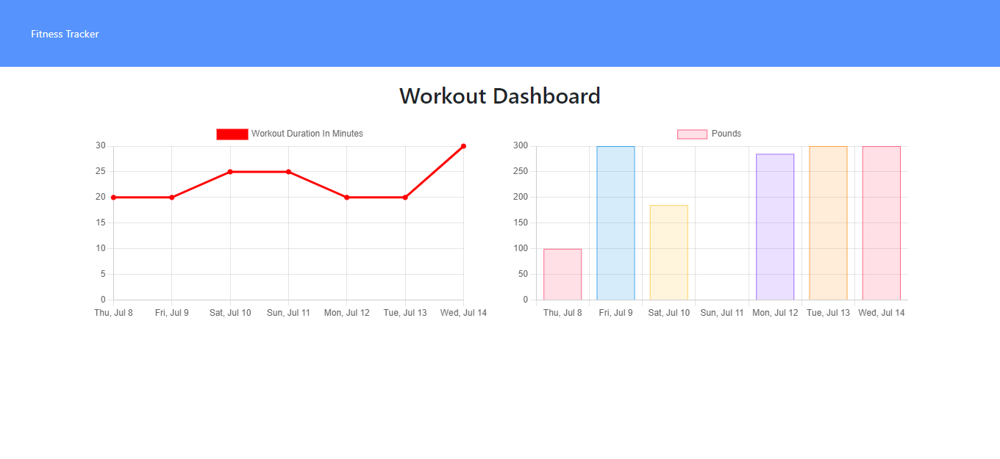
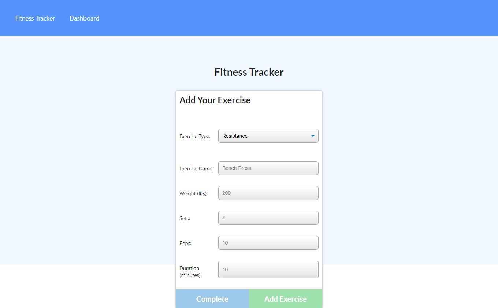

# Workout Tracker

## Description

A web app that wil help you track your workouts. You can add different types of workouts, different types of exercises, view the latest workout, and the stats for the past 7 days.

## User Story

```
As a user, I can view create and track daily workouts.
As a user, I can log multiple exercises in a workout on a given day.
As a user, I can track the name, type, weight, sets, reps, and duration of exercise.
If the exercise is a cardio exercise, I am able able to track my distance traveled.
```

## Technologies used

- HTML
- CSS
- JavaScript
- ExpressJS
- MongoDB
- Mongoose

## Screenshots

Homepage


Dashboard


New workout


## Link to Deployed Application

You can access the deployed application by clicking [HERE](https://workoutt-tracker.herokuapp.com/)

## Link to GitHub Repository

You can access the GitHub Repository by clicking [HERE](https://github.com/ttudorandrei/workout-tracker)
